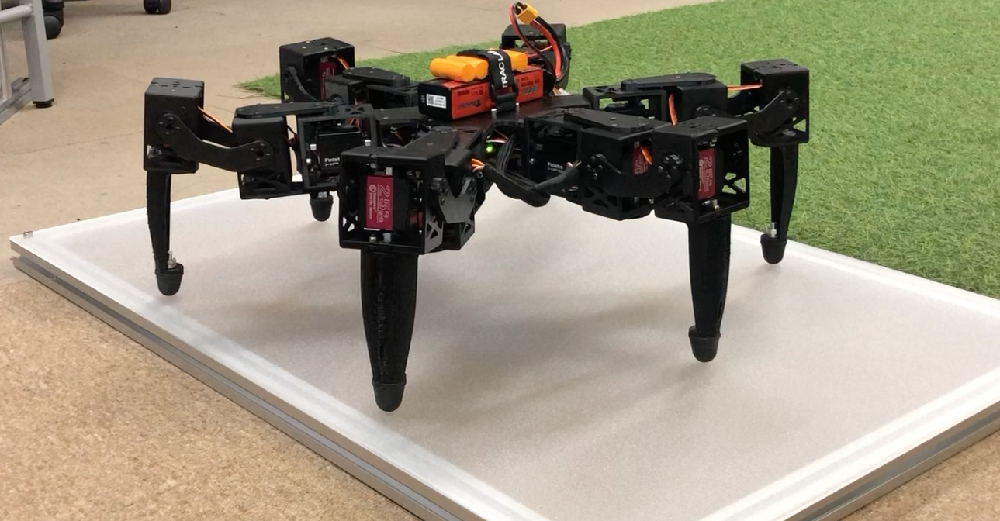

# Hexapod class

This hexapod class is to use with ESP32 dev kit in Arduino framework.

The frame is from 3D printed parts, and the actuators are just RC servo as Futaba A700 and DS3225.

## Concept

Coordinate frame O is the placed on the center body where $`Y_O`$ is the pointing forward direction, and $`X_O`$ is pointing rigth-sided direction of robot would be going.

### Forward Kinametics

### Inverse Kinematics

### Foot motion for walking

## Implementation

