# Hexapod class

This hexapod class is to use with ESP32 dev kit in Arduino framework.

The frame is from 3D printed parts, and the actuators are just RC servo as Futaba A700 and DS3225.

## Concept

Coordinate frame O is placed on the center body where $`Y_O`$ is the pointing forward direction, and $`X_O`$ is pointing rigth-sided direction of robot would be going. The legs notation is used as leg1, leg2, leg3, leg4, leg5, and leg6, or sometimes as leg i, leg j, leg k, leg l, leg m and leg n interchangeably.

The kinematics and foot motion will be thought on leg 1 or leg i frame, and then other legs could get the result by applying the homogenous transformation according to each leg's frame.

Let's see just a single leg kinematics first.

### Forward Kinametics

Here we look only just leg i, the coordinate frame of each joint is shown. The joint coordinate frame needs to be place carefully otherwise the DH-parameters would be incorrect. The coxa link has link lenght as $`L_1`$, femur leg as $`L_2`$ and tibia link as $`L_3`$. The joint angle offset $`\alpha_1`$ of coxa link is 90 degrees. 

The way to fill up DH-parameters on the table is refered to the text book from ROBOT ANALYSIS The Mechanics of Serial and Parallel Manipulators from LUNG-WEN TSAI.

Then we can create transformation matrices of $`{}^{0}_{}T^{}_{1}`$, $`{}^{1}_{}T^{}_{2}`$, $`{}^{2}_{}T^{}_{3}`$, and $`{}^{0}_{}T^{}_{3}`$ as following.

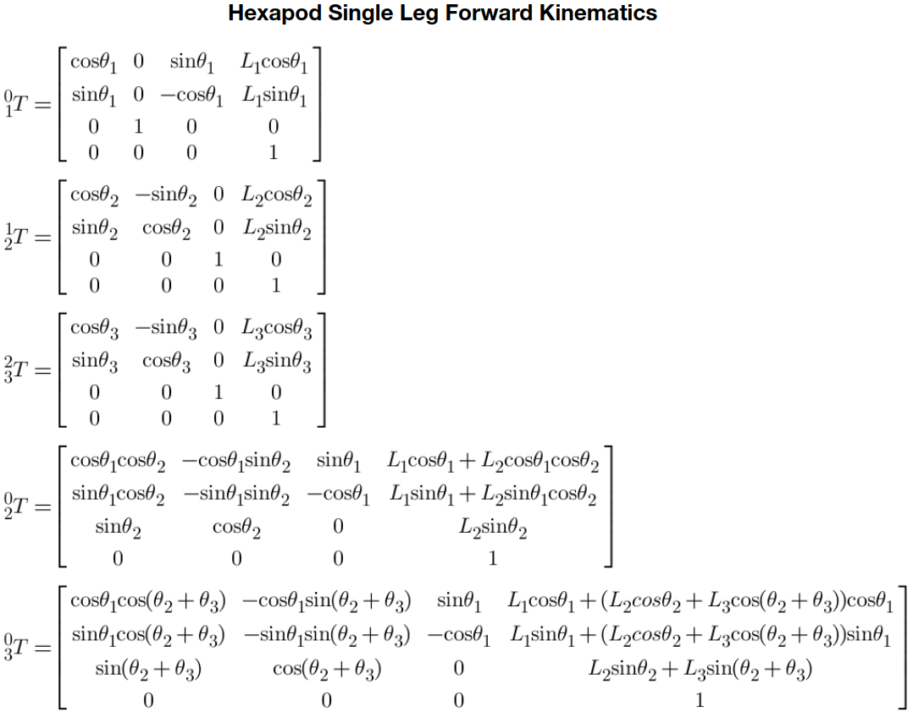

For example, when all of $`\theta_1`$, $`\theta_2`$ and $`\theta_3`$ are zero, then the leg will be strecth out fully. And as my design, the tibia link is not flipable so most of the time $`\theta_3`$ will be negative number because it's alway pointing a foot down.

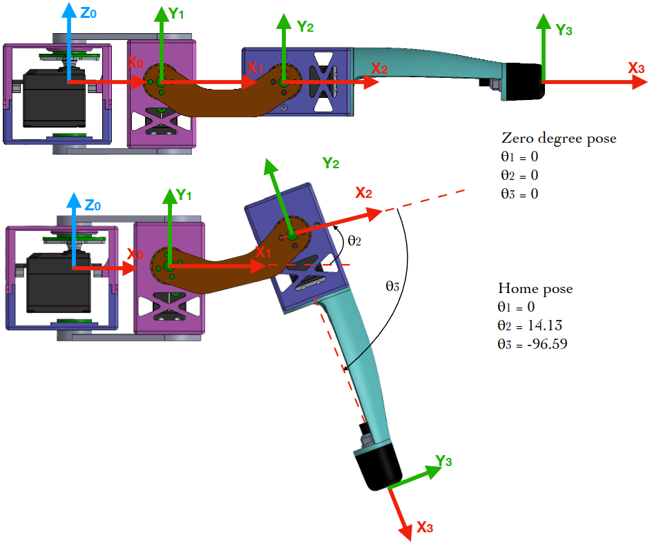

The last column of $`{}^{0}_{}T^{}_{3}`$ is showing X, Y, Z of foot position according to $`0^th`$ frame. 

### Inverse Kinematics

I am using analytical method to solve inverse kinematics. The diagram below is showing a posture where $`\theta_1`$, $`\theta_2`$ and $`\theta_3`$  are not zero and the foot is pointing to the ground. If $`X_p, Y_p, Z_p`$ of foot position are given, then $`\theta_1`$, $`\theta_2`$ and $`\theta_3`$ could be calculate from the following equations. The femur and tibia links are formed as triangle $`L_2 L_3 r_1`$ so we could use cosine rules to solve angles of $`\phi_1`$, $`\phi_2`$ and $`\phi_3`$ which will give the result of desired joint angle of $`\theta_1`$, $`\theta_2`$ and $`\theta_3`$.

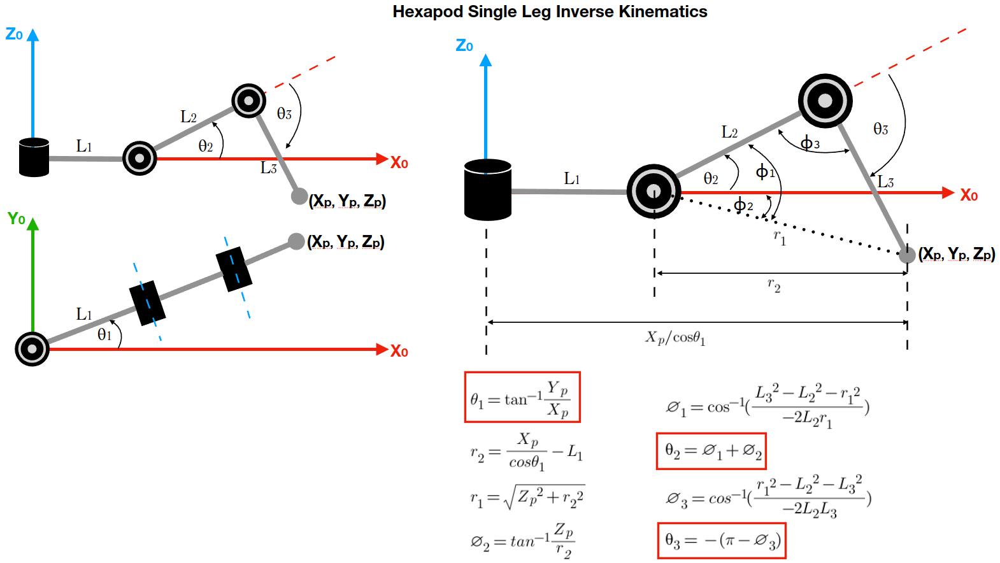

### Foot motion for walking

In order to make the hexapod walk, we're using only tripple gait pattern (most common), where three legs are on ground and other three legs are lifting up. 

So the foot motion is divided to two phases as stance (line) and swing (curve) phases.

We can think about this as on $`0^th`$ frame of the leg. The stance phase is just a simple line and it depends on which direction to go then the point starts from positive or negative sides. The swing phase is a curve line which has the same end point of stance phase. This curve line is known as Bezier's curve where you define three points and you will get the parametic equations of horizontal and vertical axes.

In this case, the stance phase is defined by parameter $`T`$. $`S`$ is a height offset from origin point, and $`A`$ is the height of step. From these three parameters, we can have three points as $`P_1`$, $`P_2`$ and $`P_3`$. The line and curve equation can be made as following.

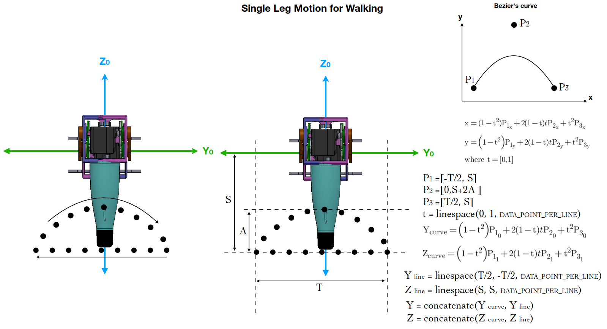

These points we got are in Y-Z plane, so depends on how far the leg should be strecth, we decide the X data point according to that.

To apply these point to other leg frame, we could think these points are firstly in O-frame (body static frame),

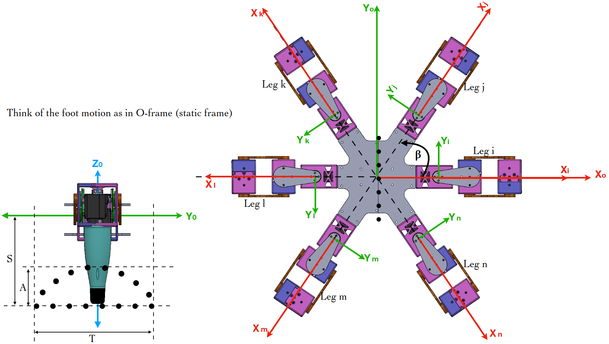

then we can apply a transformation to each leg depends on the rotation and offset distance of each leg frame. In case of robot would be walking forward ($`Y_O`$ direction), then the points in each leg should be as in the picture below.

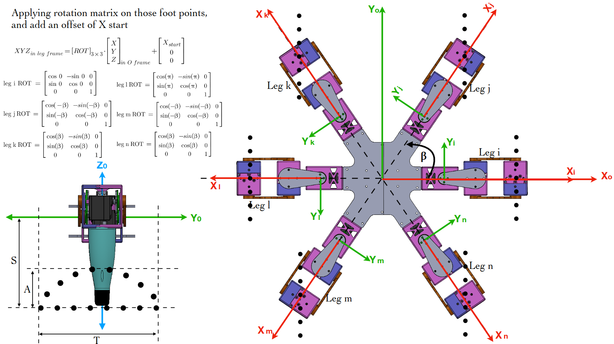

If we rotate these points around itself, then we can have a  crab-walking motion where the robot could walk along any direction.

To make the robot turning in-place, we can make up a simple rule of leg motion as following, then leg i, leg k, and leg m would have the same motion, and leg j, leg l, and leg n would have the same motion.

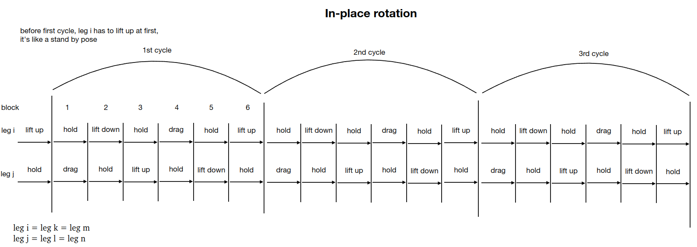

To make the robot walking like car steering, we could imagine the robot is turning with the radius of $`R_{ICC}`$, this idea is similar to differential drive mobile robot where it's moving in circular path. The inner legs of the circle will have shorter range, and outer legs of circlr will have bigger range.

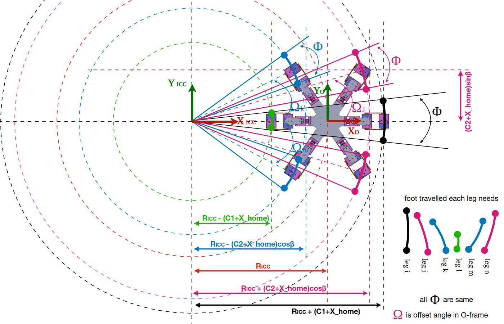

Let's keep the leg i path as a guide line, so the stance phase will now not only just a straight line but an arc of circular path. The arc angle is $`\Phi`$, and because all of the legs is turning around $`O_{ICC}`$ point as circle, so each leg should move within the same arc angle $`\Phi`$, but as each leg has different radius, so the path is not same for all. But once we calculate the guide line path of leg i, then we can use the same technique of homogenous transformation to transform these points into each leg frame.

## Implementation

The microcontroller is ESP32 Dev kit C type. The servo drive is Adafruit 12-channels PWM driver, and we use two of that. To control the robot wirelessly, I am using Futaba radio controller, so on the receiver side we need to parse SBUS data which comes from UART2 port. And the BNO055 IMU for self leveling function.

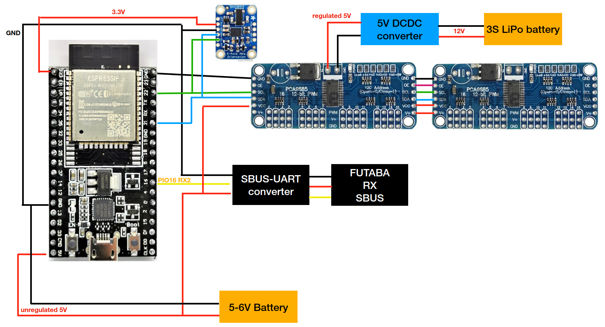

The servo on joint 1, I used Futaba A700 because I already have a bunch of this servo from other project, so I reuse that. For joint 2 and 3, I use DS3225 a cheap 20kg.cm servo. The servo angle and kinematics angles are different in each joint and each servo, so the table below is showing the correc mapping value of PWM value, servo angle (in degrees) and joint kinematics angle (in degrees).

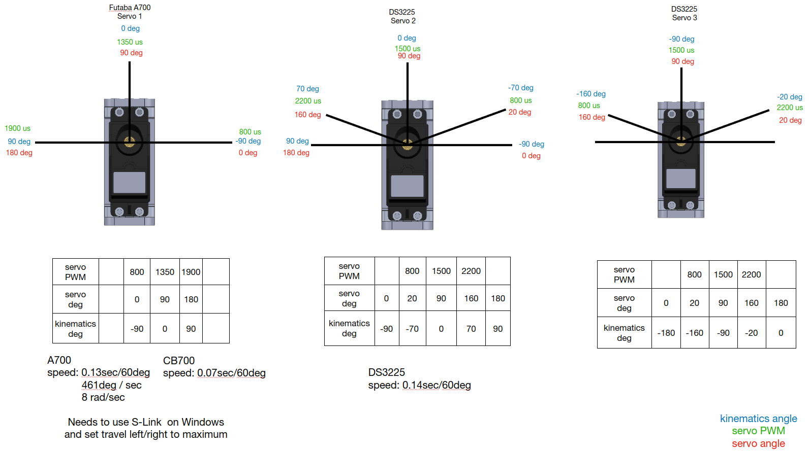

To operate the robot, the radio channels on Futaba Tx are assigned.

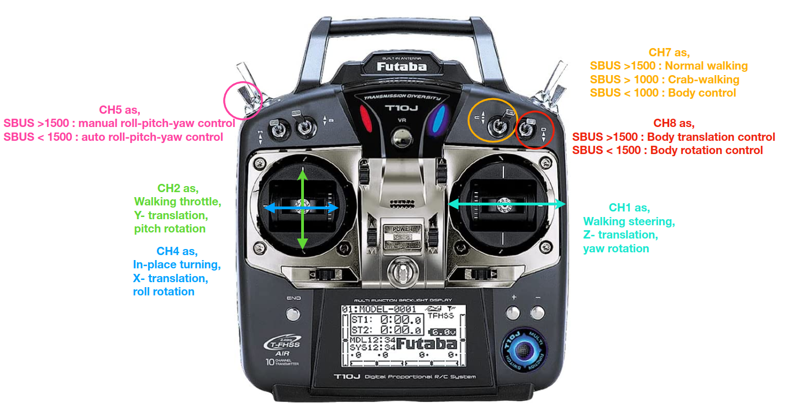