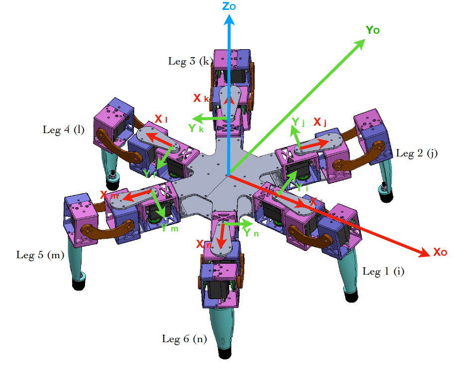
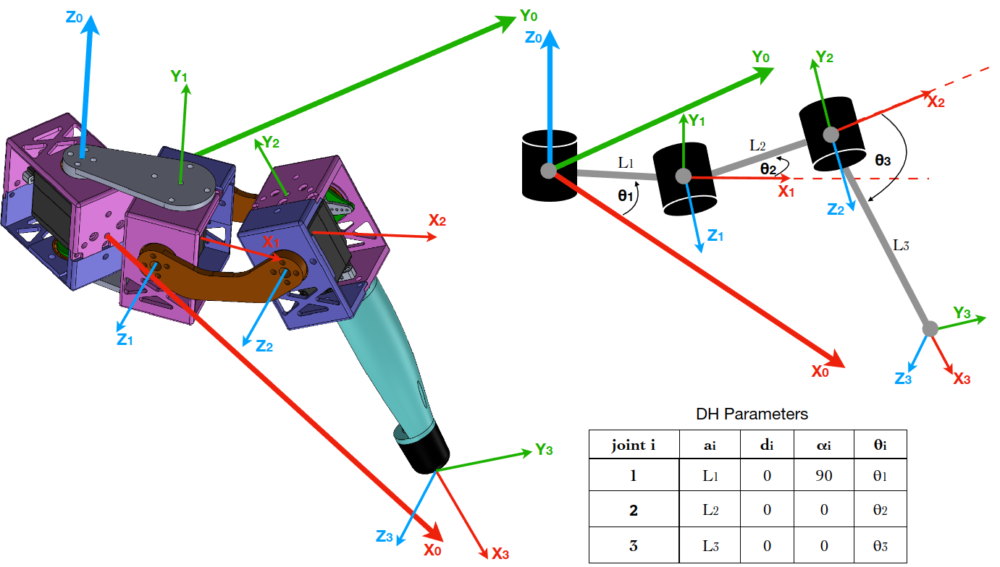
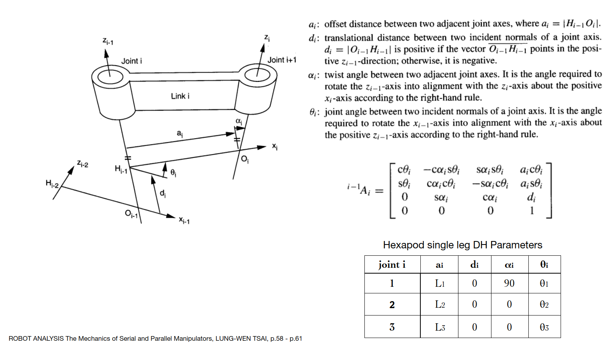

# Hexapod class

This hexapod class is to use with ESP32 dev kit in Arduino framework.

The frame is from 3D printed parts, and the actuators are just RC servo as Futaba A700 and DS3225.

## Concept

Coordinate frame O is placed on the center body where $`Y_O`$ is the pointing forward direction, and $`X_O`$ is pointing rigth-sided direction of robot would be going. The legs notation is used as leg1, leg2, leg3, leg4, leg5, and leg6, or sometimes as leg i, leg j, leg k, leg l, leg m and leg n interchangeably.

The kinematics and foot motion will be thought on leg 1 or leg i frame, and then other legs could get the result by applying the homogenous transformation according to each leg's frame.

Let's see just a single leg kinematics first.

### Forward Kinametics

Here we look only just leg i, the coordinate frame of each joint is shown. The joint coordinate frame needs to be place carefully otherwise the DH-parameters would be incorrect. The coxa link has link lenght as $`L_1`$, femur leg as $`L_2`$ and tibia link as $`L_3`$. The joint angle offset $`\alpha_1`$ of coxa link is 90 degrees. 

The way to fill up DH-parameters on the table is refered to the text book from ROBOT ANALYSIS The Mechanics of Serial and Parallel Manipulators from LUNG-WEN TSAI.

Then we can create transformation matrices of $`{}^{0}_{}T^{}_{1}`$

### Inverse Kinematics

### Foot motion for walking

## Implementation

